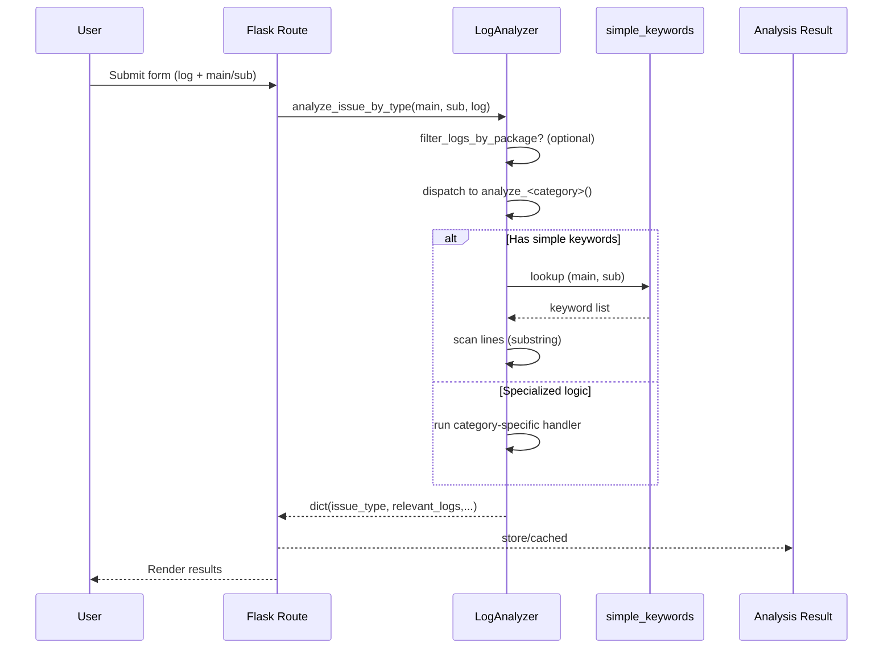
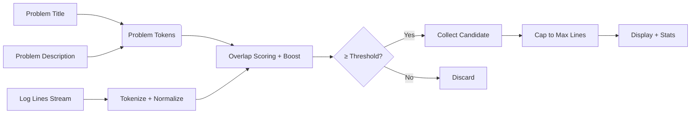
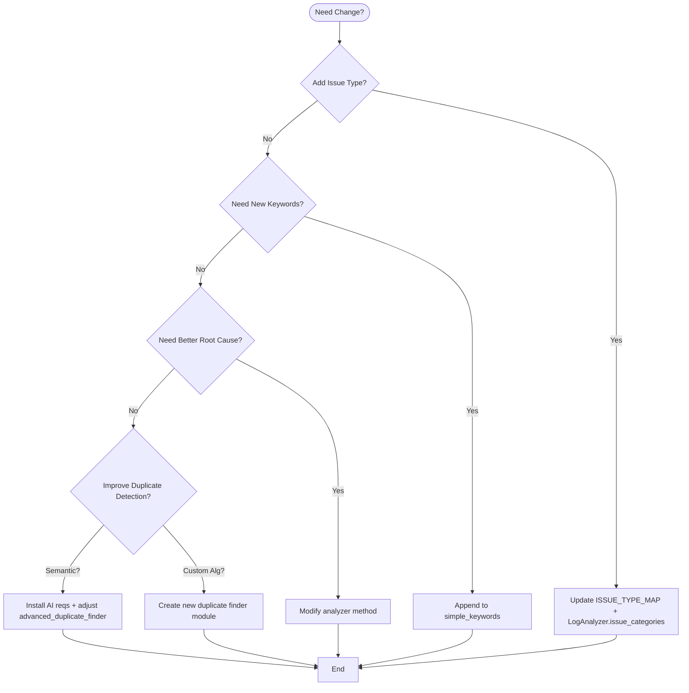

# PLM Log Analyzer – Developer & Customization Guide

This guide documents the implemented features, core logic, recent UI/UX enhancements, and practical extension points so you (or future contributors) can safely adapt the tool: adding new issue types, keywords, analysis logic, duplicate detection strategies, translation layers, or UI refinements.

---
## 1. High‑Level Overview
The application is a Flask web tool for:
- Structured Android issue triage (issue type + sub type) with minimal heuristic extraction.
- Focused log preview (build/system props + crash/ANR stacks + ActivityManager crash events).
- Duplicate issue detection (lightweight token/sequence or optional semantic embeddings).
- Translation workspace (stubbed translator) for normalizing non‑English issue text.
- Smart Detection experimental page: targeted line overlap scoring with heuristic + optional sentiment boost.
- Modern interactive UI (dark/light themes, resizable panes, gradient cards, accessible focus states).

Primary entry: `app.py` and `analyzers/log_analyzer.py`.

---
## 2. Key Enhancements Implemented in This Iteration
(Chronological clusters – useful change log)
1. Global Theming
   - Dark/light toggle persisted in `localStorage` across all main pages: Index, Duplicate Finder, Translate, Smart Detection.
   - Explicit light‑mode variable overrides for contrast, border, accent, hover, focus.
2. UI Surfaces & Visual Hierarchy
   - Gradient panel backgrounds; card wrappers around option groups (upload, problem description, controls, summaries).
   - Colored icon accents per label for rapid visual scanning.
   - Header chips / later unified gradient headers (Translate page) then reverted & refined per feedback.
3. Resizable Layouts
   - Draggable vertical resizers with width persistence on: main index sidebar, Duplicate Finder input/results split, Smart Detection sidebar.
4. Duplicate Finder Revamp
   - Gradients, softer dividers, summary grid, card façades, subtle resizer handle; divider softened/removed in light mode.
5. Translation Workspace
   - Pane header styling, card label chips, then simplified (transparent title text) & alignment fixes.
   - Flicker reduction on textarea focus by trimming transitions.
6. Smart Detection Page Redesign
   - Brought into navigation system + theme toggle, gradient backgrounds, card for inputs.
   - Slider (range) control for threshold (simplified to a single slider + live % text).
   - Larger accessible slider thumb, removed numeric spinner, consistent label/icon set.
   - Upload panel restyled to match main page; pointer events fix for overlay flicker.
7. Accessibility & Polish
   - Focus outlines (browser defaults replaced by accent ring where needed).
   - Reduced flashing by limiting heavy transitions on large repaint elements.

---
## 3. Architecture & Data Flow

Component Layers:
1. Browser (HTML templates under `templates/`) – user inputs, uploads, triggers analyses via form posts or fetch API.
2. Flask Routes (`app.py`) – orchestrate file handling, caching, duplicate detection, translation stub, smart detection API.
3. Analyzer Layer (`analyzers/log_analyzer.py`) – category/subcategory dispatch, keyword scans, specialized extraction utilities.
4. Optional Semantic Layer (`advanced_duplicate_finder.py`) – embeddings & similarity caching (only if deps installed).
5. Translator Layer (`translator/simple_translator.py`) – stub; can be replaced with real offline or API translator.
6. Cache & Persistence – ephemeral store in `cache_store/` for log entries + analyses + embedding caches.

---
## 4. Core Modules & Responsibilities
| Module | Responsibility |
|--------|----------------|
| `app.py` | Flask app, routing, cache management, duplicate & translation endpoints, issue map constants. |
| `analyzers/log_analyzer.py` | Issue category registry, keyword scanning, per‑category analyzer stubs, preview logic. |
| `advanced_duplicate_finder.py` | Advanced (semantic) duplicate detection (optional). |
| `translator/simple_translator.py` | Minimal placeholder translator (identity or simple transform). |
| `templates/*.html` | UI pages (Index, Duplicate Finder, Translate, Smart Detection, results). |
| `tests/` | Contains lightweight duplicate finder tests (extensible for new logic). |

---
## 5. Issue Detection Flow
1. User uploads log & selects (or triggers) issue category/subtype.
2. `ISSUE_TYPE_MAP` in `app.py` enumerates available main types and sub types.
3. `LogAnalyzer.analyze_issue_by_type` dispatches to a dedicated method (e.g., `analyze_app_crashes`).
4. Each analyzer method can:
   - Filter by package (if provided).
   - Perform keyword scan (`_simple_keyword_scan`).
   - Return structured result: `issue_type`, `relevant_logs`, `root_cause`, `analysis_method`.
5. Preview assembly uses `LogAnalyzer.generate_preview` to create a noise‑reduced snapshot.

---
## 6. Data Structures of Interest
- `ISSUE_TYPE_MAP` (in `app.py`): main type -> list[sub types]. Drives UI drop‑downs and eager analysis loops.
- `LogAnalyzer.simple_keywords`: dict of `(main, sub) -> [keyword ...]` (lowercased match). Minimal heuristic for quick extraction.
- Analysis Result Object (example):
  ```json
  {
    "issue_type": "App Crashes - App Crashes",
    "relevant_logs": [ {"line_number": 123, "matched_line": "FATAL EXCEPTION ...", "keyword": "fatal exception"} ],
    "root_cause": "Preliminary keyword-based extraction (simple scan).",
    "analysis_method": "Simple Keyword Scan"
  }
  ```
- Duplicate record (lightweight finder): `{ 'issue': {'title': ..., 'content': ...}, 'similarity': 87.5 }`

---
## 7. Customization Recipes
### 7.1 Add a New Main Issue Category & Sub Types
1. Edit `ISSUE_TYPE_MAP` in `app.py`:
   ```python
   ISSUE_TYPE_MAP['Graphics Issues'] = ['Rendering Lag', 'Texture Corruption']
   ```
2. Add entry to `LogAnalyzer.issue_categories` (mirrors front‑end lists).
3. (Optional) Add simple keywords:
   ```python
   self.simple_keywords[('Graphics Issues', 'Rendering Lag')] = ['frame drop', 'jank', 'swapbuffer']
   ```
4. Implement analyzer method (optional advanced logic) in `LogAnalyzer`:
   ```python
   def analyze_graphics_issues(self, log_content, sub_issue_type, package_name=None):
       simple = self._simple_keyword_scan(log_content, 'Graphics Issues', sub_issue_type)
       if simple:
           return { 'issue_type': f'Graphics Issues - {sub_issue_type}', 'relevant_logs': simple, 'root_cause': 'Keyword scan matched.', 'analysis_method': 'Simple Keyword Scan' }
       return self._empty_result('Graphics Issues', sub_issue_type, 'Custom Graphics Analysis')
   ```
5. Register in dispatcher map inside `analyze_issue_by_type`.

### 7.2 Add/Refine Keywords for Existing Sub Type
Edit `simple_keywords` map in `log_analyzer.py` – keep them lowercase & concise for substring match.
```python
self.simple_keywords[('Network Issues','Connection Problems')] += ['refused', 'network unreachable']
```

### 7.3 Add Regex Pattern Matching
If you want pattern context extraction (multi‑line) beyond simple keywords, extend `issue_patterns` or create a custom analyzer body using `re` searches. Pattern hits can push entries into `relevant_logs`.

### 7.4 Provide Advanced Root Cause Logic
Inside a specific `analyze_*` method, apply stack parsing, statistical counts, or correlation. Keep output stable:
```python
return {
  'issue_type': 'Network Issues - HTTP Errors',
  'relevant_logs': relevant_logs,  # list of {line_number, matched_line, ...}
  'root_cause': summary_text,
  'analysis_method': 'Heuristic + Pattern Mix'
}
```

### 7.5 Modify Focused Log Preview Rules
Edit `generate_preview` in `log_analyzer.py` to:
- Add new sections (e.g., thread dumps, tombstones).
- Adjust max caps (`max_preview_lines`).
- Change which lines are considered signal.

### 7.6 Introduce New Duplicate Similarity Strategy
1. Create a new module, e.g. `custom_duplicate_finder.py` implementing a class with:
   - `__init__(self, csv_path)` to load issues.
   - `find_duplicates(self, title, content, threshold, max_results)` returning sorted list.
2. In `app.py`, conditionally import & prefer it (after advanced). Provide feature flag via env var.

### 7.7 Extend Semantic Duplicate Finder
Open `advanced_duplicate_finder.py` and:
- Swap model name (e.g., to `sentence-transformers/all-mpnet-base-v2`).
- Add domain adaptation: pre‑normalize text (lowercase, strip package noise) before embedding.
- Implement chunking if issue descriptions are extremely long.

### 7.8 Plug In Real Translator
Replace logic in `translator/simple_translator.py`:
```python
from deep_translator import GoogleTranslator
class SimpleTranslator:
    def translate(self, text, target_lang='en', source_lang=None):
        return GoogleTranslator(source=source_lang or 'auto', target=target_lang).translate(text)
```
Update requirements if needed & handle rate limiting (retries/backoff). All pages already store theme preference; translation page reads/writes `source_text` & `translated`.

### 7.9 Adjust Smart Detection Algorithm
Endpoint `/api/smart_detect` (in `app.py` – search for smart detect logic) can be enhanced to:
- Tokenize problem description & log lines using stemming / lemmatization.
- Weight lines by sentiment (already sentinel variable path shown) or error token categories.
- Add configurable boosters (e.g., negative sentiment + crash word synergy).
Expose new parameters via Smart Detection form.

### 7.10 Change Threshold Slider Behavior
UID currently uses pure range input + live text. To add a color gradient fill or dynamic label steps, add JS in Smart Detection page where slider update occurs.

---
## 8. Theming & Frontend Patterns
Shared patterns across pages:
- CSS custom properties controlling surfaces, text, borders, accent gradients.
- Attribute `data-theme="dark|light"` toggled via small script storing `plmTheme` in `localStorage`.
- Resizers persist widths via `localStorage` keys: `sidebarW`, `dupLeftW`, `smartSidebarW` (names may vary by page; see each script block).
- Light mode uses explicit gradient + border overrides; subtle inner shadows lighten components without losing contrast.

When adding a new page:
1. Copy a toggle snippet:
```html
<button id="themeToggle" class="theme-toggle"><i class="fas fa-adjust"></i></button>
<script>(function(){const s=localStorage.getItem('plmTheme');document.body.dataset.theme=s||'dark';document.getElementById('themeToggle').onclick=()=>{const b=document.body;b.dataset.theme=b.dataset.theme==='light'?'dark':'light';localStorage.setItem('plmTheme',b.dataset.theme);};})();</script>
```
2. Reuse variables and supply any page-specific gradient backgrounds.

---
## 9. File Upload Handling
- Input uses hidden `<input type="file">` + stylized label for drag‑and‑drop.
- Drag listeners highlight border (adding `drag-active` class).
- Large file limit enforced by `MAX_CONTENT_LENGTH` (500MB) plus front-end messaging.
- Uploaded logs stored in `uploads/`; ephemeral cache under `cache_store/` for analyses.

To add validation (e.g., disallow > X lines): perform server check post‑save and early return with error JSON.

---
## 10. Caching & Persistence
- In‑memory: `LOG_CACHE` holds recent logs + per (main, sub) analysis results.
- Persistent: each log gets a directory in `cache_store/` with `log.txt` and `meta.json` for reload.
- Pruning: least recently added beyond `MAX_CACHE_ITEMS` and size pruning beyond `CACHE_SOFT_MAX_BYTES`.
- Duplicate embeddings (semantic) cached with hashed file signature + model name (see `advanced_duplicate_finder.py`).

If you add new heavy artifacts (e.g., vector indices), store them beneath a subfolder and extend pruning logic to detect their size.

---
## 11. Testing Strategy
- Existing `pytest` tests cover lightweight duplicate finder and structural cache stats.
- Suggestions:
  - Add tests for new analyzer methods: feed synthetic logs & assert keyword extraction count.
  - Add integration test for `/api/analyze` with sample log payload.
  - For semantic duplicates, mock embeddings for determinism.

---
## 12. Deployment & Offline
Run development:
```
python app.py
```
Offline bundling script (`scripts/prepare_offline_env.py`) pre‑downloads wheels + model files; follow README offline steps.
For production: wrap with a WSGI server (gunicorn / waitress) and serve behind reverse proxy; increase worker timeout for very large logs.

---
## 13. Extending Log Extraction Logic Safely
When writing deeper analysis:
1. Keep expensive passes single‑scan (iterate lines once, collect matches in dictionaries / counters).
2. For multi‑line patterns (stacks), locate anchors (e.g., `FATAL EXCEPTION`) then capture subsequent frames until blank line.
3. Normalize lines (lowercase copy) only once per loop for keyword detection.
4. Limit memory: avoid storing entire 500MB log repeatedly—operate on line iterators when feasible.

Pseudo pattern:
```python
for idx, line in enumerate(log_content.splitlines(), start=1):
    low = line.lower()
    # fast rejects before running heavy regex
    if 'exception' in low or 'anr' in low:
        if fatal_re.search(line):
            collect_stack(idx)
```

---
## 14. Common Extension Hooks Summary
| Goal | Location | Action |
|------|----------|--------|
| New issue category | `ISSUE_TYPE_MAP` & `LogAnalyzer.issue_categories` | Add entries + analyzer + dispatcher mapping |
| Add keywords | `LogAnalyzer.simple_keywords` | Append list (lowercase) |
| Custom root cause | Inside analyzer method | Build explanatory `root_cause` text |
| New duplicate logic | New file + import in `app.py` | Provide `find_duplicates` method |
| Semantic model change | `advanced_duplicate_finder.py` | Change model name / caching strategy |
| Translation engine | `translator/simple_translator.py` | Replace stub with real translator |
| Log preview tuning | `LogAnalyzer.generate_preview` | Adjust extraction sections |
| UI theme additions | Each template `<style>` blocks | Extend CSS variables |
| Slider / control variant | Smart Detection template | Modify slider markup/JS |

---
## 15. Suggested Future Improvements
- Structured JSON export for analyses & duplicate results.
- WebSocket streaming for very large file progressive parsing.
- Pluggable scoring weights (YAML config) for Smart Detection.
- Unified front-end stylesheet (dedupe repeated gradient + variable definitions).
- Add copy-to-clipboard buttons for matched lines & root cause.
- Integrate real multilingual translation & pre-normalize before similarity.

---
## 16. FAQ
**Q: Why do some analyses return empty relevant logs?**  
Analyzer method is a stub – extend it with patterns or keyword scans.

**Q: Where to raise max returned duplicate issues?**  
Adjust `max_results` parameter where `find_duplicates` is called (Duplicate Finder route).

**Q: How to change threshold default?**  
Front-end slider `value="80"` and server default where threshold parsed (Smart Detection endpoint). Keep consistent.

**Q: Prevent huge memory usage on 500MB logs?**  
Stream process lines (e.g., iterate file object instead of `read()`) and collect only needed ones.

---
## 17. Support / Contribution Etiquette
- Keep PRs focused (UI vs Analyzer vs Infra separately).
- Include before/after screenshots for UI changes.
- Add minimal tests for new analyzer logic.
- Document new env vars & config keys in this guide or README.

---
### Quick Customization Checklist (TL;DR)
- Add issue type: Update maps + analyzer + dispatcher.
- Add keywords: `simple_keywords`.
- Deeper logic: implement analyzer body.
- Duplicate semantics: install AI reqs, enable `AdvancedDuplicateFinder`.
- New translator: replace stub.
- UI theming: replicate toggle script & CSS variables.

Happy extending!

---
## 18. Visual Architecture & Flow Diagrams

Below are Mermaid (rendered on GitHub) and lightweight ASCII diagrams to visualize core flows.

### 18.1 High-Level Request Flow
```mermaid
flowchart LR
   Browser[User Browser\n(Upload / Forms)] --> Flask[Flask Routes\napp.py]
   Flask --> Cache{LOG_CACHE /\ncache_store/}
   Flask --> Analyzer[LogAnalyzer\n(analyzers/log_analyzer.py)]
   Analyzer --> Patterns[(Keyword / Regex\nMaps)]
   Flask --> Dup[Duplicate Finder\n(lightweight / semantic)]
   Dup -->|optional embeddings| Embed[(Sentence Model)]
   Flask --> Translator[Simple Translator\n(optional real impl)]
   Analyzer --> Result[(Analysis JSON)]
   Dup --> DupRes[(Similarity Results)]
   Translator --> TOut[(Translated Text)]
   Result --> Flask
   DupRes --> Flask
   TOut --> Flask
   Flask --> Browser
```

### 18.2 Issue Analysis Pipeline


### 18.3 Duplicate Detection (Lightweight vs Semantic)
```mermaid
flowchart TB
   A[CSV Load] --> P{Mode}
   P -->|Lightweight| Lw[SequenceMatcher / token ratio]
   P -->|Semantic| Sem[Embedding Pipeline]
   Sem --> CacheEmb[(Embeddings Cache)]
   CacheEmb --> Sem
   Sem --> SimCalc[Vector Similarity\n(cosine/top-k)]
   Lw --> Rank[Sort & Threshold]
   SimCalc --> Rank
   Rank --> Out[Top Matches ≥ threshold]
```

### 18.4 Smart Detection (Heuristic Overlap)


### 18.5 Customization Decision Tree


### 18.6 ASCII Cheatsheet (If Mermaid Not Rendered)
```
User -> Flask -> LogAnalyzer -> (keywords / custom logic) -> Result
User -> Flask -> DuplicateFinder -> (SequenceMatcher | Embeddings) -> Matches
User -> Flask -> Translator -> Normalized Text

Smart Detection:
   Problem Tokens + Each Log Line -> overlap score -> threshold gate -> keep top N -> UI
```

---
## 19. Diagram Modification Tips
Add or adjust diagrams by editing the Mermaid code blocks above. GitHub auto-renders fenced blocks starting with ```mermaid. For local preview use an editor plugin (e.g., VS Code Mermaid extension). Keep diagrams small & focused—split if they exceed ~25 nodes for clarity.

---
## 20. Quick Reference SVG Export
For published docs or slide decks you can export diagrams:
1. Open the Markdown in a Mermaid-enabled viewer.
2. Right-click the rendered diagram → Export as SVG/PNG.
3. Commit exported assets under `docs/diagrams/` if needed (avoid committing large raster duplicates).

---
_End of Developer Guide diagrams extension._

### 21.8 Environment Flag for AI Mode
`launch_plm_analyzer_ai.bat` sets `PLM_AI=1`. You can read this in Python to branch (e.g., display a badge, preload models, switch duplicate finder strategy). Example snippet you may add in `app.py`:
```python
AI_MODE = os.environ.get('PLM_AI') == '1'
if AI_MODE:
   logger.info('Starting in AI mode (semantic features enabled).')
```
Use this to:
- Preload an embedding model
- Show an AI mode indicator in templates
- Gate heavy background initializations

---

---
## 21. Desktop Launcher & Shortcuts

To simplify launching for non-technical users on Windows, a batch launcher and PowerShell shortcut creation script have been added.

### 21.1 Files
Location: `scripts/`

- `launch_plm_analyzer.bat` – Starts the Flask app (auto-installs base deps if missing) then opens the browser.
- `create_shortcuts.ps1` – Creates a Desktop shortcut (and attempts a Taskbar pin) pointing to the launcher.
- `icon/plm.ico` – (Add this) Custom icon used by the shortcut. A placeholder README is present until you supply an icon.

### 21.2 Usage
From PowerShell (optionally run as Administrator for taskbar pin):
```
cd <project-root>\scripts
powershell -ExecutionPolicy Bypass -File .\create_shortcuts.ps1
```
Double‑click the Desktop shortcut “PLM Analyzer” afterwards, or pin manually if automatic pin fails.

### 21.3 Custom Icon
Provide a square SVG → export to 256x256 PNG → convert to ICO (multiple resolutions 16,32,48,64,128,256). Name it `plm.ico` and place in `icon/`.

Sample minimal SVG badge (save as `plm.svg` before conversion):
```svg
<svg xmlns="http://www.w3.org/2000/svg" width="256" height="256" viewBox="0 0 256 256">
   <defs>
      <linearGradient id="g" x1="0" x2="1" y1="0" y2="1">
         <stop offset="0%" stop-color="#3b82f6"/>
         <stop offset="100%" stop-color="#9333ea"/>
      </linearGradient>
   </defs>
   <rect rx="32" ry="32" width="256" height="256" fill="url(#g)"/>
   <path fill="#fff" d="M64 176V80h32l32 56 32-56h32v96h-28V124l-36 60h-4l-36-60v52H64z"/>
   <circle cx="208" cy="48" r="20" fill="#10b981"/>
   <path fill="#fff" d="M203 50l5 5 9-9" stroke="#fff" stroke-width="4" stroke-linecap="round" stroke-linejoin="round"/>
</svg>
```

### 21.4 Auto Dependency Behavior
On first run, the batch script checks if Flask imports; if not, it installs `requirements.txt`. For controlled environments you can remove this auto-install block and rely on a pre-created virtual environment.

### 21.5 Optional: Semantic / AI Mode Launcher
If you want a second shortcut that ensures AI extras are installed, duplicate the batch file as `launch_plm_analyzer_ai.bat` and add:
```
pip install -r requirements-ai.txt >NUL
```
before the `start` line.

### 21.6 Troubleshooting
- Taskbar pinning is best-effort; some corporate policies block programmatic pin.
- If shortcut icon doesn’t update, delete `%LOCALAPPDATA%\IconCache.db` (last resort) or change icon index then revert.
- ExecutionPolicy errors: launch PowerShell with `-ExecutionPolicy Bypass` or sign the script.

### 21.7 Cross-Platform Notes
Linux/macOS users can create a small shell script and (on Linux) a `.desktop` file under `~/.local/share/applications/`; not included here to keep scope focused on Windows per request.

---
